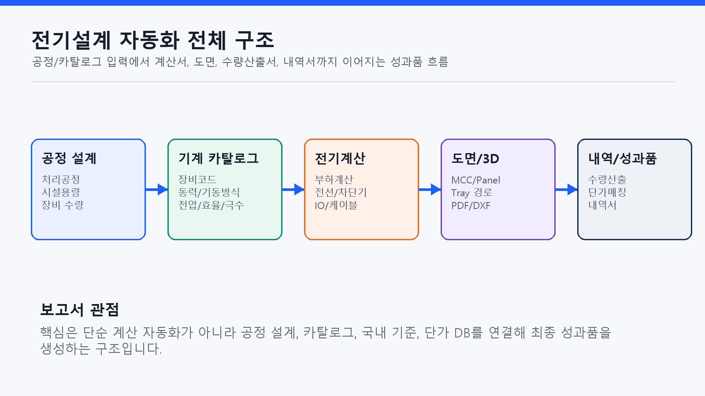
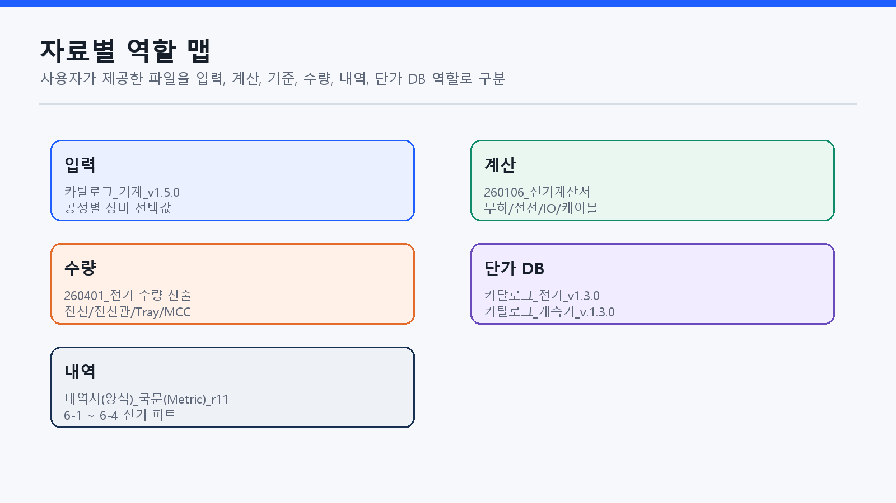
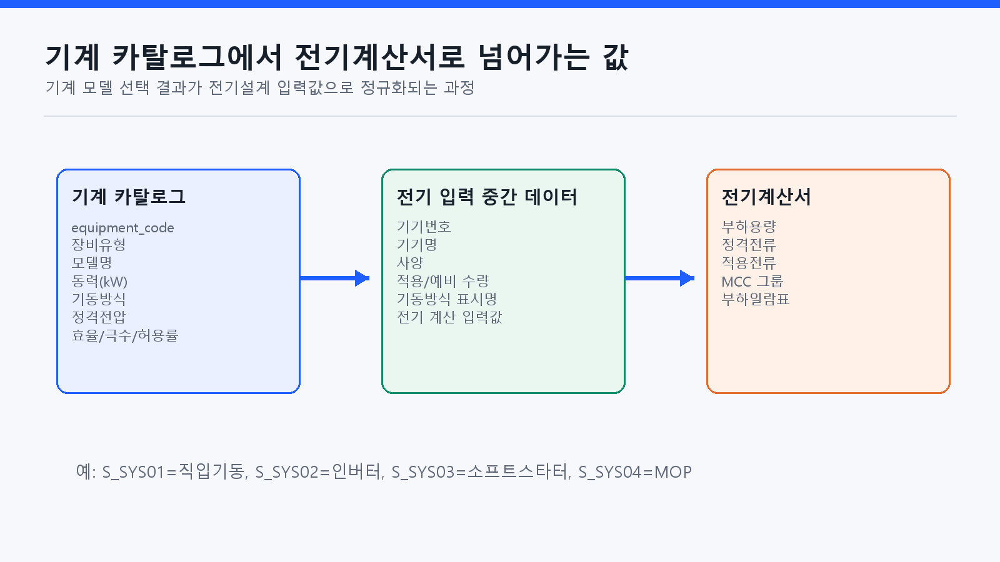
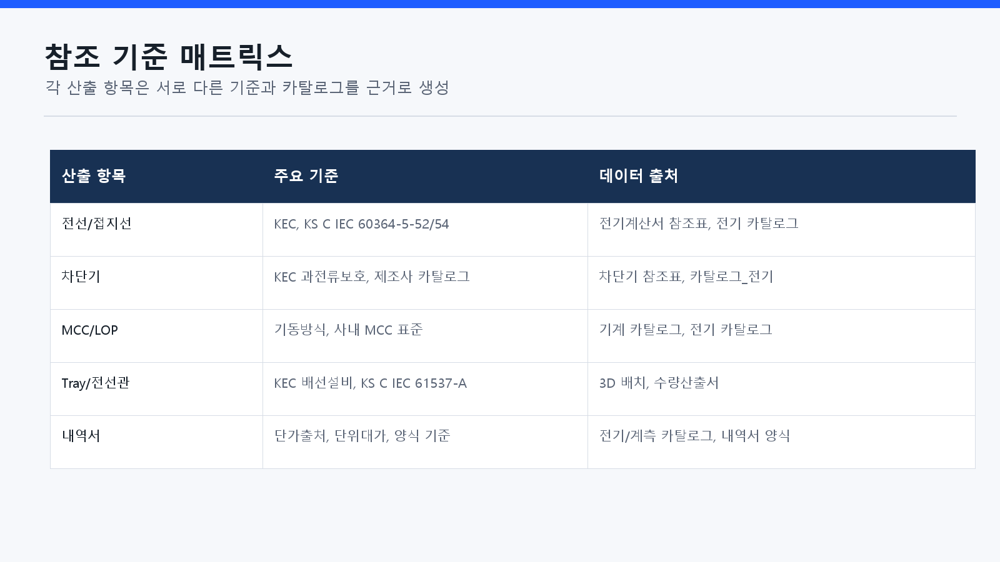
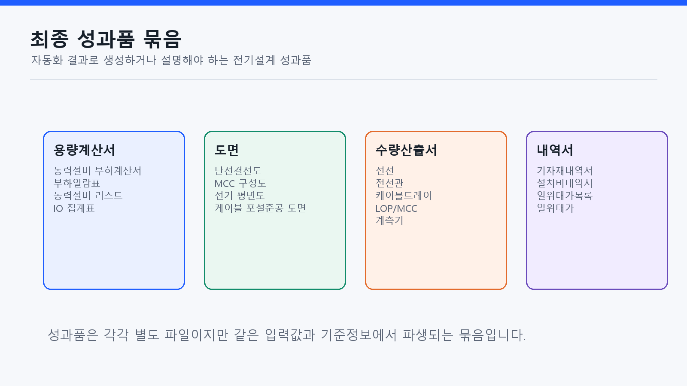
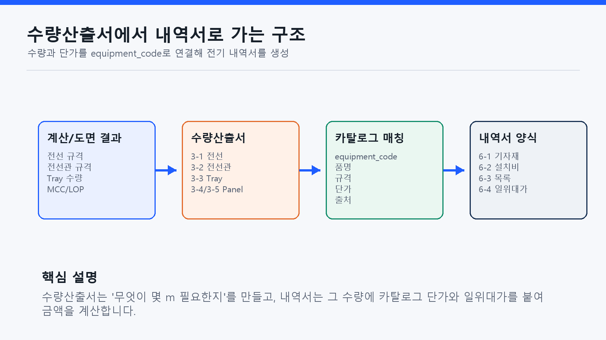

# 전기설계 자동화 구조 및 레퍼런스 보고서

## 1. 보고서 목적

전기설계 자동화 프로그램이 어떤 입력자료를 받고, 어떤 기준을 참고하며, 최종 성과품을 어떻게 생성하는지 설명하기 위한 보고자료입니다.

## 2. 참고한 원본 자료

| 자료 | 역할 |
| --- | --- |
| `카탈로그_기계_v1.5.0.xlsx` | 공정별 기계 선택 시 전기설계 입력값 제공 |
| `260106_전기계산서(최종샘플).xlsx` | 전기계산서 및 계산 흐름 원형 |
| `260401_전기 수량 산출_r3.xlsx` | 항목별 수량산출 |
| `내역서(양식)_국문(Metric)_r11.xlsx` | 전기 내역서 양식 |
| `카탈로그_전기_v1.3.0.xlsx`, `카탈로그_계측기_v.1.3.0.xlsx` | 품명, 규격, 단가 DB |

## 3. 입력 구조

## 4. 기준과 레퍼런스

| 레퍼런스 | 활용 위치 | 확인 경로 |
| --- | --- | --- |
| 한국전기설비규정(KEC) | 전선, 접지, 보호장치, 배선설비 기준 | https://kec.kea.kr/sub_about/overview.php |
| KEC 규정/핸드북/공고 | 세부 해설, 적용 기준 버전 확인 | https://kec.kea.kr/sub_about/regulation.php |
| KS C IEC 60364-5-52 | 배선설비 선정과 시공 | https://www.standard.go.kr/KSCI/standardIntro/getStandardSearchView.do?ksNo=KSCIEC60364-5-52 |
| KS C IEC 60364-5-54 | 접지설비와 보호도체 | https://www.kssn.net/search/stddetail.do?itemNo=K001010151454 |
| KS C IEC 61537-A | 케이블 트레이 및 래더 시스템 | https://www.kssn.net/search/stddetail.do?itemNo=K001010148765 |
| 기계/전기/계측기 카탈로그 | 모델, 규격, 단가, 코드 매칭 | 프로젝트 제공 XLSX 파일 |

## 5. 최종 성과품

## 6. 수량산출서와 내역서 생성

## 보고자료용 핵심 문장

WAI Design의 전기설계 자동화는 공정 설계와 기계 카탈로그 선택값을 출발점으로 삼아, 국내 전기설계 기준과 전기/계측 카탈로그 DB를 적용하고, 최종적으로 용량계산서, 도면, 수량산출서, 내역서를 일관된 데이터 흐름으로 생성하는 구조입니다.
